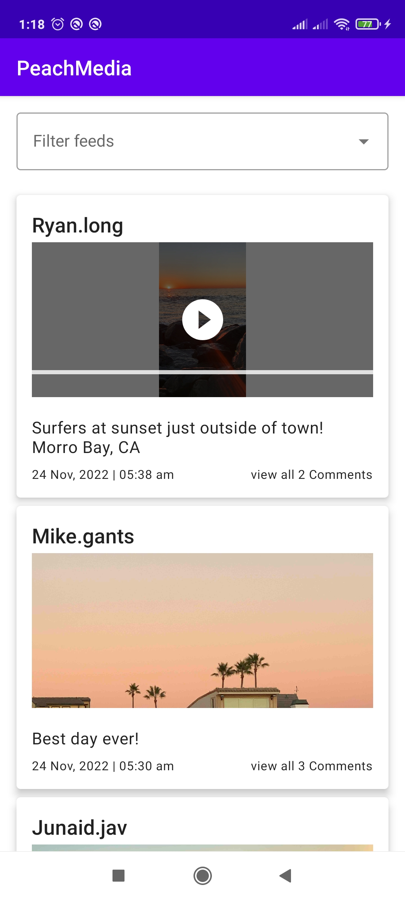
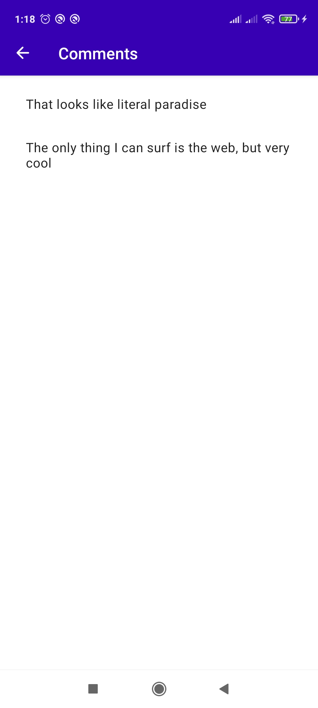

# PeachMedia
One page Jetpack Compose application that displays multimedia content in a vertical feed display

### How it's built

* Technologies used
    * [Kotlin](https://kotlinlang.org/)
    * [Jetpack Compose](https://developer.android.com/jetpack/compose)
    * [Flow](https://kotlinlang.org/docs/reference/coroutines/flow.html)
    * [KOIN Dependency](https://insert-koin.io/)
    * [Coroutines](https://kotlinlang.org/docs/reference/coroutines-overview.html)
    * [Retrofit](https://square.github.io/retrofit/)
        * [Jetpack](https://developer.android.com/jetpack)
            * [Lifecycle](https://developer.android.com/topic/libraries/architecture/lifecycle)
            * [ViewModel](https://developer.android.com/topic/libraries/architecture/viewmodel)

* Architecture
    * Clean Architecture :MVVM - Model View View Model

* Gradle
    * [Gradle Kotlin DSL](https://docs.gradle.org/current/userguide/kotlin_dsl.html)

* Testing
  AndroidComposeTest

|  | 